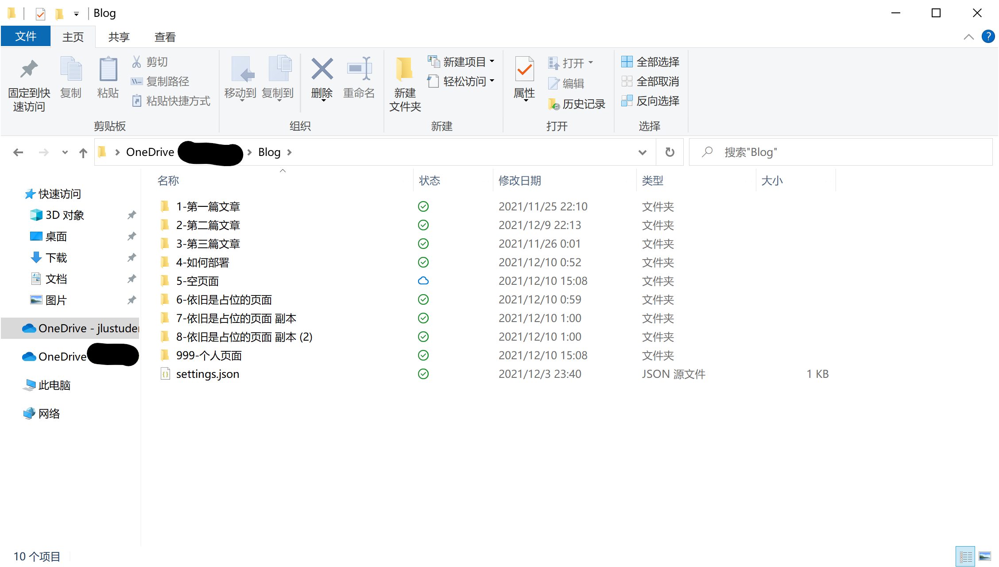

# OneDrive/Blog 以OneDrive为储存的博客“引擎”

将OneDrive中的文件夹作为博客，解析文件夹内文章的内容，发送到前端

[演示Demo](https://onedrive-blog.vercel.app)

## 使用

### 1. 获取项目

* 下载仓库源码并导入自己的仓库（此方法可以创建私有仓库）
* Fork本仓库

部署项目时，可以删除`/assete/doc`文件夹，此文件夹存放的是`README.md`内的图片。

### 2. 修改配置文件

修改根目录下文件`nuxt.congif.ts`，初始文件内容如下

```ts
import { defineNuxtConfig } from 'nuxt3'

// https://v3.nuxtjs.org/docs/directory-structure/nuxt.config
export default defineNuxtConfig({
    buildModules: [
        'nuxt-windicss',
    ],
    publicRuntimeConfig: {
        WEBSITE_NAME: 'Arect\'s blog' // 博客的名称，可修改
    },
    privateRuntimeConfig: {
        CLIENT_ID: process.env.CLIENT_ID,
        CLIENT_SECRET: process.env.CLIENT_SECRET,
        REDIRECT_URI: 'http://localhost:3000', // OneDrive的API的重定向地址，根据自己的情况设置
        REFRESH_TOKEN: process.env.REFRESH_TOKEN,
        ROOT_PATH: '/Blog', // 将OneDrive中的/Blog文件夹作为博客目录，可修改
        ONEDRIVE_URI: 'https://graph.microsoft.com/v1.0/me/drive',
        OAUTH_URL: 'https://login.microsoftonline.com/common/oauth2/v2.0/token'
    }
})
```

**注意：**
* 请自己获取OneDrive的Token，暂时不支持世纪互联（我还没有找API）。获取教程来自网络：[链接](https://blog.imzjw.cn/posts/cf-onedrive/) ，获取`client_id`、`client_secret`以及`refresh_token`，如果按照网络教程，在获取`refresh_token`时出错，可以在本地（需要`Nodejs`环境）下执行`npx @beetcb/ms-graph-cli`，按步骤获取；
* 目录格式为`/Dir1/Dir2/Dir3`，项目内没有其它特殊处理，所以格式错误可能会导致访问出错。

### 3. 部署至Vercel

在Vercel中新建项目，导入你的仓库，在部署前设置环境


填入：

| 环境名 | 值             |
|:----|:--------------|
| CLIENT_ID | client_id     |
| CLIENT_SECRET | client_secret |
| REFRESH_TOKEN | refresh_token |

如果你的项目是私有的，可以直接在`nuxt.config.ts`中填写。请千万保护自己的Token们。

点击部署按钮，等待部署完成。部署完成后可以自定义域名，这些就不在讨论范围内了。

### 4. 开始使用

#### 全局设置

在你的OneDrive文件夹内，创建`settings.json`，内容如下：

```json
{
    "saying": "出现在博客上方的一行大字",
    "desc": true
}
```

目前只有这些（欸嘿嘿），`desc`是指文章的排序方式，顺序或逆序。

#### 编写文章

在博客文件夹内新建文件夹，命名格式为`index-title`，例如`1-第一篇文章`，项目将`-`用于分隔序号和标题，所以标题中若含有`-`会导致标题切割。后续将修复此问题。

进入文件夹，创建文件`index.html`、`index.md`或`index.txt`，可以编写`html`或是纯文本。创建`settings.json`，输入内容如下：

```json
{
    "password": "123"
}
```

可以对文章创建密码。

注意，Markdown中若要插入图片，暂时只能利用图床；目前所有的`settings.json`都可空。

此时OneDrive文件夹应该如下所示：



> 遇到问题可以直接发issue

## 关于UI

因为Nuxt3支持的UI框架还比较少，所以目前的界面样式都还是简单设计的，可能不是很好看。如果希望有更好看的界面的话，不妨自己动手，将本项目作为API，自己编写前端。目前本项目只有两个API，放在`server/api`目录下（能动手写前端，应该能看懂API返回的内容）。但是后期我还想添加内容，所以接口大概还会调整。

## 下一步

等我懒完这段时间，想将Markdown的图片完善好，目前Markdown中想插入外部资源，只能利用图床或者类似的东西，下一步想直接读取本地数据，但是设计上还需要多思考一下。

## 闲话

关于为什么要做这个项目呢？都用上Vercel了，为什么不直接上Hexo呢？emm因为我想自己做点东西，调用一下微软的API，至于为什么要**调用**微软的API，懂的都懂，不懂的可以直接去用Hexo了，这才是真的博客引擎。

Markdown样式来自`Github-markdown-css`，但是为了兼容深色模式所以不得不保存到项目并修改了一小部分。感谢`Github-markdown-css`
